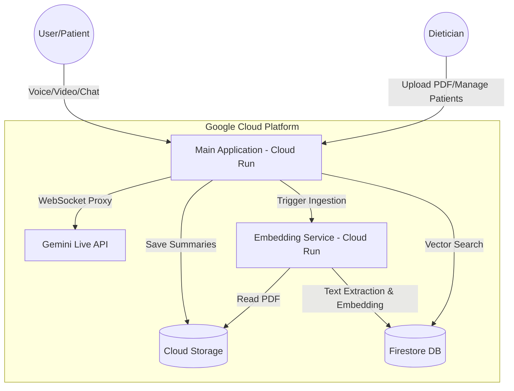

# NutriBuddy Architecture

## Overview
NutriBuddy is a twin-service cloud application designed to bridge the gap between dieticians and patients using real-time AI. It leverages Google Gemini Live for voice interactions and a Retrieval-Augmented Generation (RAG) system for accessing patient medical records.

## System Diagram

## Core Components

### 1. Website Service (The Portal)
- **Role**: Entry point for all users.
- **Location**: `services/website_service/`
- **Tech**: Python, `aiohttp`.
- **Functions**:
    - Serves the React/JS frontend.
    - Manages Firebase Authentication.
    - Proxies WebSockets to the Gemini Live API.
    - Handles CRUD operations for patient-dietician assignments.
    - Saves conversation summaries to Cloud Storage.

### 2. Embedding Service (The Worker)
- **Role**: Background processor for heavy document ingestion.
- **Location**: `services/embedding_service/`
- **Tech**: Python, `functions-framework`.
- **Functions**:
    - Triggered via HTTP from the Main App (secured with OIDC).
    - Downloads PDF files from Cloud Storage.
    - Extracts text and generates vector embeddings using a Vertex AI model.
    - Indexes medical data in Firestore for semantic searching.

### 3. Data Layer
- **Firebase Auth**: Identity management.
- **Firestore**: Stores user profiles, patient assignments, and vector embeddings.
- **Cloud Storage**: Stores raw PDF medical records and session history JSONs.

### 4. AI Engine
- **Gemini Live API**: Multi-modal real-time interaction handler.
- **Vertex AI (text-embedding-004)**: Generates high-dimensional vectors for medical data retrieval.
